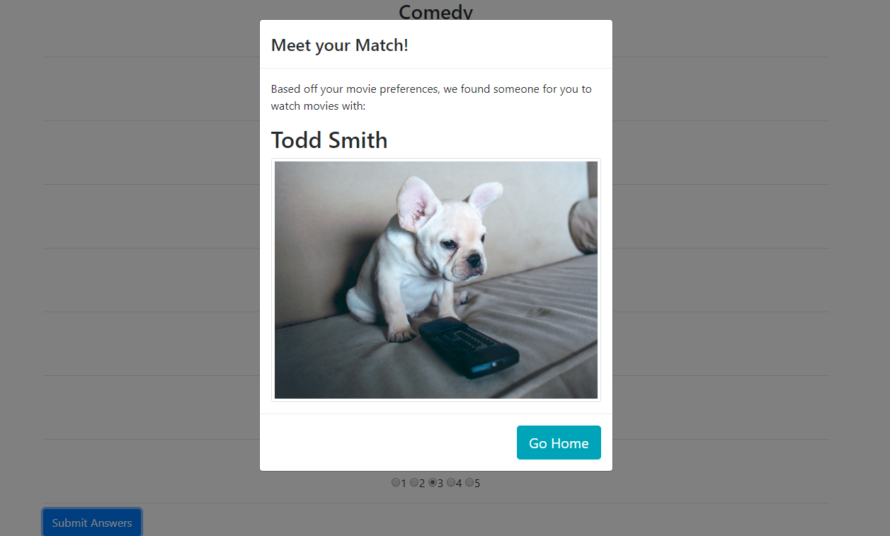

# MoviePals
Movie Pals is a full-stack web application which uses the Express.JS framework for Node. The front-end serves up a survey to users to determine their movie-taste profile. The profile is then stored on the back end and the user data is analyzed against previous users in order to determine and ideal movie-watching pal for the user.

# Link to Deployed Site
[Movie Pals](https://movie-pals.herokuapp.com/)

# Images


# Technology Used
- HTML
- Bootstrap
- JavaScript (jQuery)
- Node.js
- Express.js
- Body-Parser
- Heroku

# Code Snippets
```
    $.post("/api/friends", userData).then(function(data) {
        console.log('returned data', data)
        $('#matchName').text(data.name)
        $('#matchPic').attr('src', data.photo)
        $("#myModal").modal({backdrop: 'static', keyboard: false})
    })
```
The code displayed above exists on the html page for the survey. This Post request is called after the user's inputs and survey responses have been validated and then stored into the userData JavaScript object. Code stored in a separate JavaScript file is executed by this call, after which the data for the user's match is returned to this page. The information is then posted to a modal and displayed for the user.
```
    app.post("/api/friends", function(req, res) {
        // handle incoming survey results
        var user = req.body;
        friends.push(user)
        
        // handle compatibility logic.
        res.json(findMatch(user, friends))
    })
```
The snippet above is the aforementioned code triggered by the Post Request. When the request is made, the user is pushed into the friends array so later user's can be compared to him. Once that has been done, the server responds with the results of the findMatch function, which compares the user's movie preferences to those of all previous users and returns the user whose tastes align most closely with the new user.


# Learning Points
- Organizing a Full Stack website, utilizing a segmented file/folder structure to handle data, front-end pages, and server routing separate from the main server file.
- Deploying web application on Heroku in order to allow full-stack functionalities such as storing and retrieving form data to and from a back-end server.
- Using node packages to load html files based off of desired urls as opposed to file stucture.
- Creating an algorithm that determines a result for a user by runing through data on a backend server and comparing against user submitted information.
- Creating, storing and displaying data as JSON objects.
- Maintaining RESTful design and architecture in regards to GET and PUT calls.
- Using onerror html attributes to display a default placeholder images in the event that a user submitted picture is not available for use.

# Author 
Azfar Haq - [GitHub](https://github.com/aehaq)

# License
Standard MIT License